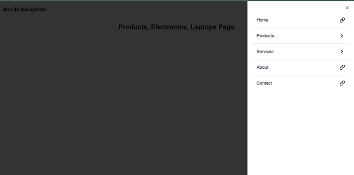
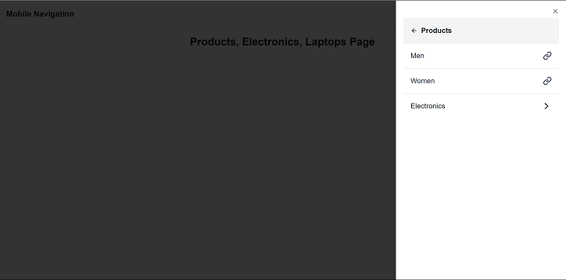

# Mobile Navigation

## 🚀 Overview

This project is a **solution** to the below task

#### Task Breakdown

Create a mobile navigation UI that displays a list of titles.

#### Navigation logic

- When a title with a URL is clicked, navigate to the specified URL.
- When a title with children is clicked, replace the current list with the list of child titles.

#### Child Navigation logic

- If a child title with a URL is clicked, navigate to that URL.
- If a child title with its own children is clicked, replace the current list with that child's titles.

#### Parent Navigation logic

- When a list of child titles is shown, display the parent title at the top along with a back button.
- Back button behavior: Clicking the back button should return the user to the previous list (parent titles). I

#### Dynamic structure handling:

- The structure of titles can be modified at any time with new children added to titles.
- The code must handle unlimited nesting of children and grandchildren dynamically, ensuring the UI correctly reflects any changes to the data at all levels of the hierarchy.

## Screenshot



###



## Links

- Live Site URL: (https://mobile-navigation-andemosa.vercel.app/)

## My process

### Built with

- TypeScript
- [Next.js](https://nextjs.org/)
- [Tailwind](https://tailwindcss.com/)
- [ShadcnUI](https://ui.shadcn.com/)
- [Framer Motion](https://www.framer.com/motion/)

## Getting Started

This is a [Next.js](https://nextjs.org) project bootstrapped with [`create-next-app`](https://nextjs.org/docs/app/api-reference/cli/create-next-app).

First, run the development server:

```bash
npm run dev
# or
yarn dev
# or
pnpm dev
# or
bun dev
```

Open [http://localhost:3000](http://localhost:3000) with your browser to see the result.

You can start editing the page by modifying `app/[[...route]]/page.tsx`. The page auto-updates as you edit the file.

This project uses [`next/font`](https://nextjs.org/docs/app/building-your-application/optimizing/fonts) to automatically optimize and load [Geist](https://vercel.com/font), a new font family for Vercel.

## Author

- Anderson Osayerie - [@andemosa](https://andemosa.tech)
- Twitter - [@andemosa](https://www.twitter.com/andemosa)
